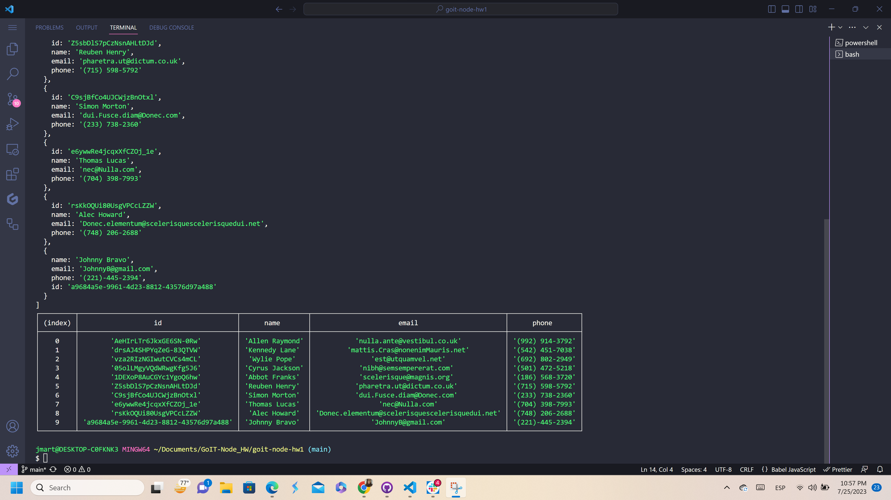
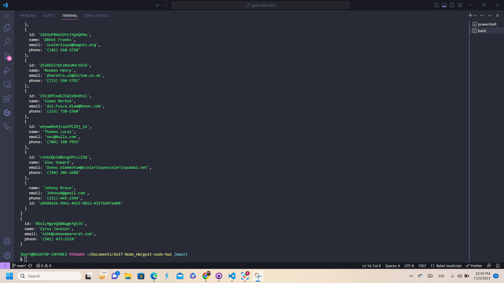
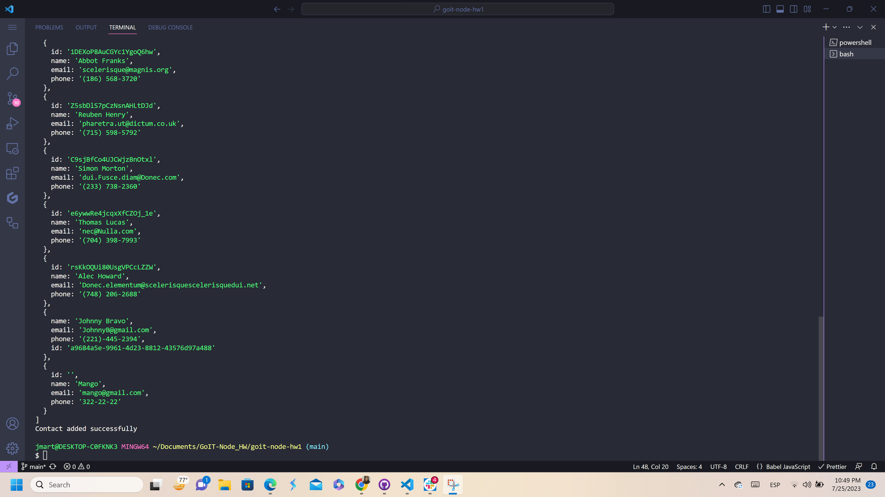
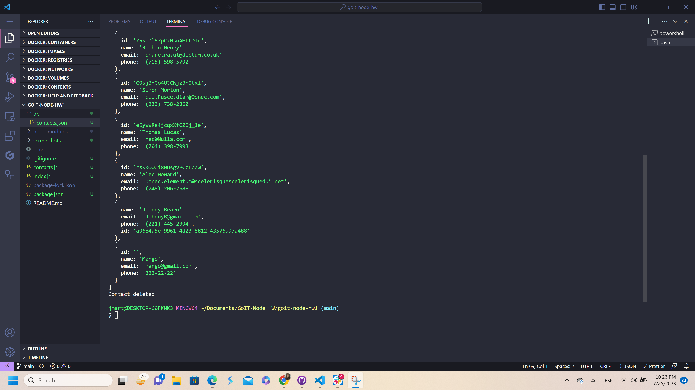

<p align="center">
  <a href="" rel="noopener">
</p>

<h3 align="center">goit-node-hw1</h3>

<div align="center">

[]()
[](https://github.com/kylelobo/The-Documentation-Compendium/issues)
[](https://github.com/kylelobo/The-Documentation-Compendium/pulls)
[](/LICENSE)

</div>

---

<p align="center"> A console application that adds, removes, gets, and finds contacts.
    <br> 
</p>


## 🏁 Getting Started <a name = "getting_started"></a>

These instructions will get you a copy of the project up and running on your local machine for development and testing purposes. See [deployment](#deployment) for notes on how to deploy the project on a live system.


## 🔧 Running the tests <a name = "tests"></a>


```
node index.js --action list
```

Gets and displays the entire list of contacts in the form of a table.



```
node index.js --action get --id 05olLMgyVQdWRwgKfg5J6
```
Gets contact by id.



```
node index.js --action add --name Mango --email mango@gmail.com --phone 322-22-22
```
Add the contact



```
node index.js --action remove --id qdggE76Jtbfd9eWJHrssH
```
Delete the contact




## ⛏️ Built Using <a name = "built_using"></a>

Framework
- [NodeJs](https://nodejs.org/en/) - Server Environment


